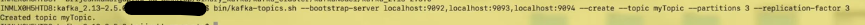
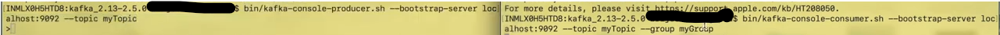
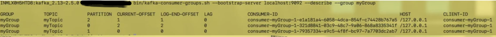

# Prerequisites:

- Start zookeeper cluster
- Start kafka cluster
- Create Topic

- Describe topic

- Create producer and consumer with consumer group myGroup:

- publish messages from producer and consumed by consumer

- Describe consumer group - Same consumer id is subscribing to all partition as we have only one consumer running 

- create one more consumer under same CG

- describe CG - in this first consumer(1f) is subscribing 2 partition 0,1 and new consumer(a5) is subscribing partition 2

- start 3rd  consumer(b7) and describe it

- publish more message and see whether it is consumed in round-robin fashion to all consumers
- first 3 message were published when only 1 consumer was active

- start 4th consumer so that 1 will sit ideal(it can be existing one) and describe it

