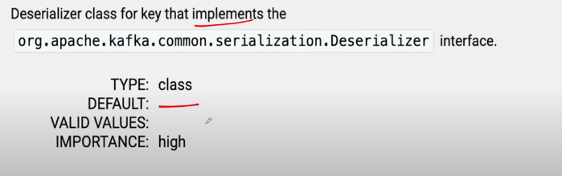
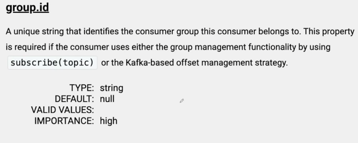
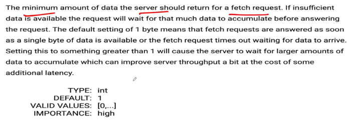
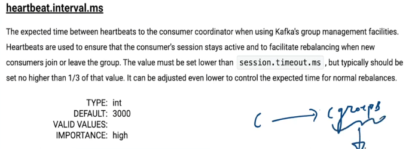
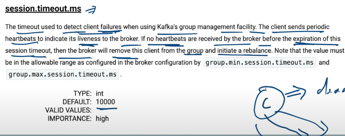
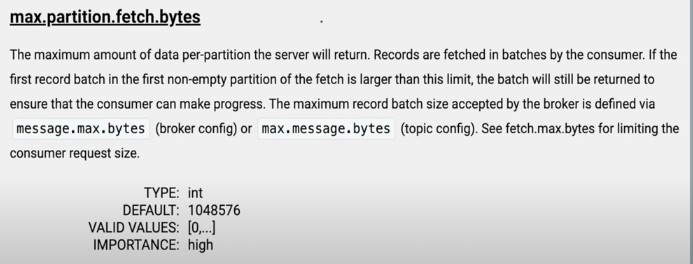
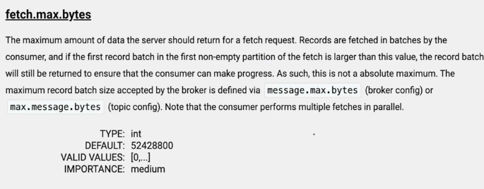

# Consumer Config

### 1) bootstrap.server 

same concept as producer

### 2) client.id

same concept as producer

### 3) key & value Deserializer

- process of converting stream of bytes to abject
- default value is byteArraySerializer

### 4) group.id
- mandatory config for consumer group

### 5) fetch.min.bytes
- default value is 1 byte

### 6) heartbeat.interval.ms

- each consumer send heartbeat to group coordinator to let the kafka cluster know that the consumer is alive
- value should be lower than session.timeout.ms
- time between 2 heartbeats
- default is 3 sec
- it should be 1/3rd of session.timeout.ms

### 7) session.timeout.ms

- each consumer send heartbeat to group coordinator to let the kafka cluster know that the consumer is alive
- default value is 10 sec
- if consumer doesn't send heart beat in 10 sec then it is considered to be dead

### 8) max.partition.fetch.bytes

- max amount of data per-partition the server will return

### 9) fetch.max.bytes

- max amount of data server should return for a fetch request

