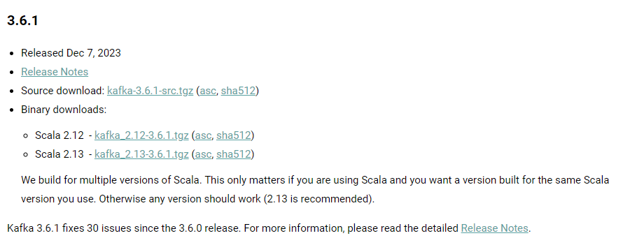
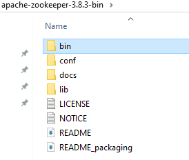
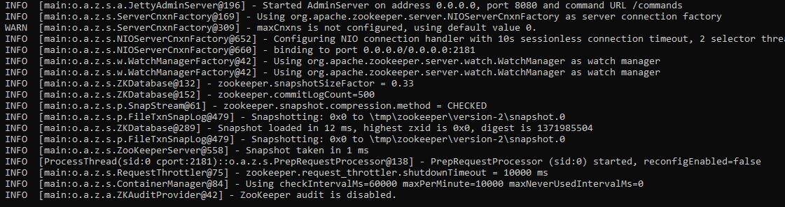
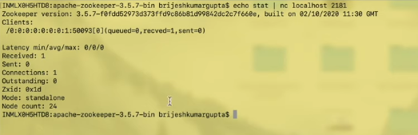
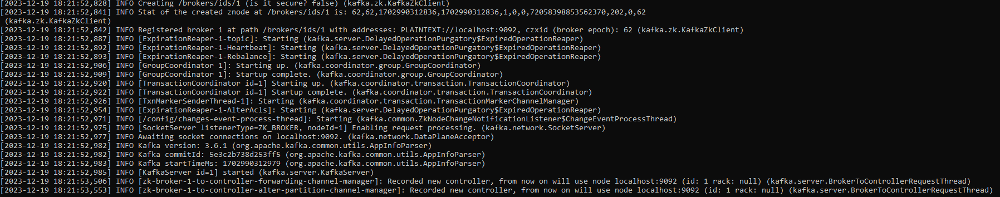

# Kafka Installation

* Require java 8 or higher version
* Minimum RAM 512 mb
* Kafka is written in JAVA and scala
* We need JAVA and scala binary
* Current version as of Dec, 2023 is 3.6.1

### Download Apache Kafka from official page

**Step 1:** Download Scala 2.13 binary and check release notes for stable zookeeper version

**Step 2:** Download compatible zookeeper version 3.8.3 (Download bin.tar.gz file)

We first need to setup zookeeper then kafka cluster

**Extract scala and kafka binaries**

    from command line use command tar -xf filename

After extracting we need to start zookeeper server.

    goto bin/zkServer.sh or bin/zkServer.cmd -> used for starting zookeeper server

It searches for config file in location conf/zoo.cfg

We need to create that file from sample

    add property 4lw.commands.whitelist=* -> 4 letter words

Property meaning - 

* clientPort=2181 (if any clients wants to connect zookeeper then it will use this port)
* dataDir=tmp/zookeeper (whatever data zookeeper keep related to cluster resides in this. tmp is volatile dir so data removed after restart)

Now start zookeeper using bin/zkServer.sh start-foreground

this command takes other param like start/stop/start-foreground/restart/status/print-cmd

### Installation instructions for Zookeeper on Windows

* Install Java JDK
* Set env variable 'JAVA_HOME' to 'c:\Program Files\Java\jdk1.8.0_144'
* Set env variable 'ZOOKEEPER_HOME' to 'C:\dev\Kafka\zookeeper-3.4.10', and append 'C:\dev\Kafka\zookeeper-3.4.10' to "Path" sys variable
* Rename "zoo_sample.cfg" to "zoo.cfg" in C:\Tools\zookeeper-3.4.10\conf, and change its value for "dataDir" from "/tmp/zookeeper" to "c:\zookeeper-3.4.10\data" (or whatever)
* Run "C:\dev\Kafka\zookeeper-3.4.10\bin\zkServer.cmd"
* Open 'C:\dev\Kafka\kafka_2.11-0.11.0.0\config\server.properties' and set its value for "log.dirs" to "C:/dev/Kafka/kafka_2.11-0.11.0.0/kafka-logs"
* Run "C:\dev\Kafka\kafka_2.11-0.11.0.0\bin\windows\kafka-server-start.bat C:\dev\Kafka\kafka_2.11-0.11.0.0\config\server.properties"
* Use Kafka Tool (www.kafkatool.com/index.html) to connect to localhost:2181

In order to validate zookeeper is running. Use command:

    echo stat | nc localhost 2181

standalone - meaning single instance of zk node is running

stat has 4 letter word. 4lw is used to support this. zookeeper has blacklisted these 4lw so we need to enable it in zoo.config file

if zookeeper is running in background then we can stop it using command

    zkServer.sh stop

### Installation instructions for Kafka on Windows
* extract kafka
* Open 'D:\kafka\kafka_2.13-3.6.1\config\server.properties' and set its value for "log.dirs" to "D:/kafka/kafka_2.13-3.6.1/kafka-logs"
* Run "D:\kafka\kafka_2.13-3.6.1\bin\windows\kafka-server-start.bat D:\kafka\kafka_2.13-3.6.1\config\server.properties"
* Use Kafka Tool (www.kafkatool.com/index.html) to connect to localhost:2181
* For windows - D:\kafka\kafka_2.13-3.6.1\bin\windows

In server.properties file change below properties
1) broker.id=1
2) listeners=PLAINTEXT://localhost:9092 -> this broker will listen on 9092 port
3) log.dirs=D:/kafka/kafka_2.13-3.6.1/kafka-logs
4) log.retention.hours=168 -> default is 7 days(168 hours) in order to retain the messages
5) zookeeper.connect=localhost:2181 -> kafka connect zookeeper on port 2181 using this property

Start kafka

### Validate Kafka using zookeeper:

    echo dump | nc localhost 2181 | grep brokers
    result would be - /brokers/ids/1

### if kafka is running in background then we can stop it using command

    kafka-server-stop.bat

### Run kafka in background

    D:\kafka\kafka_2.13-3.6.1\bin\windows\kafka-server-start.bat -daemon D:\kafka\kafka_2.13-3.6.1\config\server.properties

### Check kafka logs

    logs/server.log

### Check zookeeper log

    logs/fileNAme.out

[Sample zoo.cfg file](./zoo.cfg)

[Sample server.properties file](./server.properties)

  

