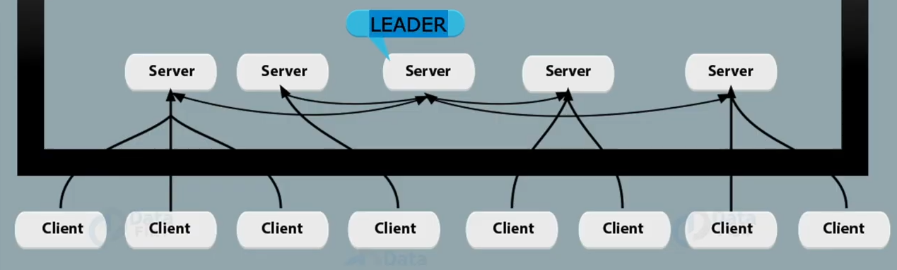
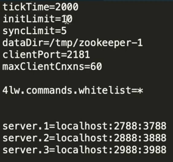
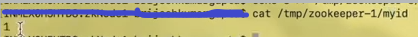

# Zookeeper Cluster Architecture

Below image have ZK cluster(inside black box) and Kafka clients

- ZK cluster contains zk nodes
- One node will be elected as leader
- all the nodes perform voting in order to select leader. They send their vote to the desired node and the node who have maximum votes will be elected as leader
- leader election has 2 algorithms.
- Leader distribute work to other nodes
- If any client make such request which can change the state of zk cluster, then leader decide whether to accept the request and if accept then which node will perform this request

### ZK Cluster requirement:

- Java 8 or higher
- Ram minimum 1gb
- if we are running zk cluster then nodes should be in odd number(1,3,5,7). This will help to elect the leader otherwise sometime it may fall in race condition

### Setting up ZK CLuster with 3 nodes:
- Download binary
- Copy tar file in 3 different folder
- un-tar file of all three folder
- Change the zoo.cfg file for all nodes as below

    tickTime=2000

    initLimit=10 - when a zk node connects with zk cluster it has max 10 units of time to connect with zk cluster. 

    10 units of time is 20 sec. 1 unit of time is 2 sec

    syncLimit=5 - if any nodes is out of sync with zk cluster then it has 5 unit of time to get back in sync. If it not come in sync then zk cluster will move out that node from cluster

    dataDir=/tmp/zookeeper-1 - it holds zk cluster and kafka client related data

    clientPort=2181 - kafka client can connect with zk node on this port

    maxClient=60 - max number of kafka client connect with this zk node

    server.1=localhost:2788:3788
    server.2=localhost:2888:3888
    server.3=localhost:2988:3988

    As we are running 3 nodes in zk cluster so we need to mention  all 3 nodes in all zoo.cfg file
    server.1 - 1 is the unique id of zk node 1. 2 is for zk node 2 and so on
    first port 2788 will be used to communicate with other zk nodes/peers
    second port 3788 will be used for leader election

### Setting up unique id for each zk node

* Create the data Directory per defined above for all zk nodes.
* Create myid file in all zk node inside datDir
* write the id value in first line

- start all 3 zookeeper node with zkServer.sh
- after starting first node, it will give some warnings as other nodes aren't up yet. We can ignore the warning and start other nodes

Validate all the zk nodes which will contain 1 leader and 2 followers

