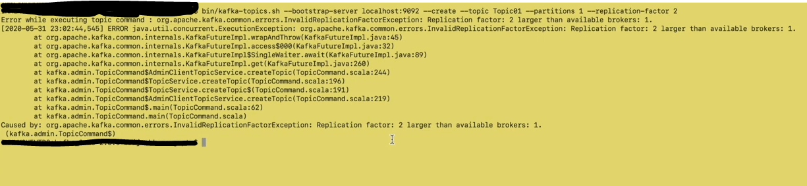
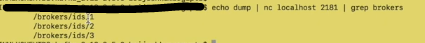
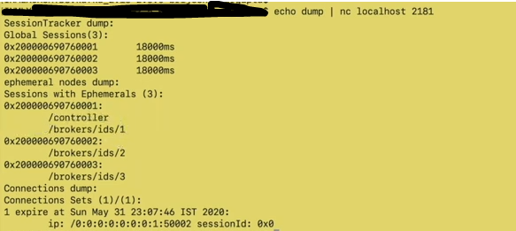
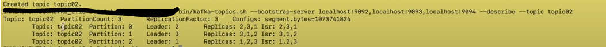
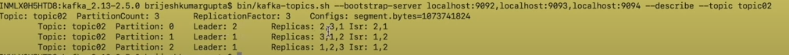

# Kafka Cluster Setup

### Basic
- for a kafka cluster to run we need zk cluster running
- kafka cluster is managed by zk cluster
- Its not necessary to have 3 node zk cluster. It doesn't matter to kafka how many nodes are there in zk cluster.

### System prerequisites for 3 nodes:
- java 8 or higher
- Ram 1 gb minimum

### Setting up kafka cluster with 3 nodes

- Download binary
- Copy tar file in 3 different folder
- un-tar file of all three folder

### Properties change in order to setup kafka cluster
Change the server.properties file for all nodes as below. Added properties file for all broker

    broker.id=1 -> unique for all nodes 
    listeners=PLAINTEXT://localhost:9092 - unique for all nodes
    log.dirs=D:/kafka/kafka_2.13-3.6.1/kafka-logs-1 - unique for all nodes
    zookeeper.connect=localhost:2181,localhost:2182,localhost:2183 - when the kafka broker will start it will first try to connect with first zk node, if unfortunately it is not able to connect with first one then it will try with second one 

Start first node of kafka cluster using kafka-server-start.sh

Case 1: Create topic using below command. This will work fine as replication factor is 1 and only 1 broker is running 

    bin/kafka-topic.sh --bootstrap-server localhost:9092 --create --topic myTopic --partitions 1 --replication-factor 1

Case 2: Create topic using below command will not work as replication factor is 2 and single kafka node is up 

    bin/kafka-topic.sh --bootstrap-server localhost:9092 --create --topic myTopic --partitions 1 --replication-factor 2

We will get below error in case 2

In order above command to work we need to have at least 2 kafka node running

check the kafka broker on zk node

    echo dump | nc localhost 2181 | grep brokers

**There will be one controller node in kafka cluster. Controller node will manage partitions and replicas and will also do other admin tasks like partition reassignment.**

### Check Controller Node:

    echo dump | nc localhost 2181

Here broker 1 is controller

We can also create topic by providing url of all brokers. when the client try to connect with kafka cluster, it will first try with first url then second and so on.

    bin/kafka-topic.sh --bootstrap-server localhost:9092,localhost:9093,localhost:9094 --create --topic myTopic --partitions 3 --replication-factor 3

    For Partition 0: leader is broker 2
    For Partition 1: leader is broker 3
    For Partition 2: leader is broker 1

broker assignment happens in round-robin fashion.

Now let's shut down 1 broker

    In this case replicas will be 3 but ISR will be 2 as only 2 brokers are running
    Also partition 1 leader will be changed to 1 from 3

After restarting broker 3 ISR will be updated to include 3 brokers 

