# Controller Node in Kafka

- Any Kafka cluster have only one controller node
- Which is responsible for managing the state of partitions and replicas and for performing admin task like reassigning partitions

To understand controller node functionality

- create kafka cluster with 3 nodes
- create topic with 3 partitions and 2 replication factor

After creating topic describe it:

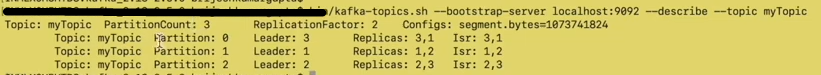

- For Partition 0 
    
      Have 2 replicas in broker(node) 1 and broker 3
    
      Leader is 3 which implies all read and write will happen from broker 1. Main working replica will be broker 3. Broker 1 will only come in to picture in case broker 3 is down
    
      **ISR is 1,3 - ISR will always be the subset of replicas. Possible combination of ISR could be {1},{3},{1,3} depending on both brokers are up or not
                 Both the brokers will always be in sync. When producer send a message to broker 3(broker 3 is leader of partition 0) then broker 1 will send a fetch request to broker 3 in order to be in sync with broker 3**

- For Partition 1

      Have 2 replicas in broker 2 and broker 3
      Leader is 2 which implies all read and write will happen from broker 2. Main working replica will be broker 2. Broker 3 will only come in to picture in case broker 2 is down

## State of Partition:

1) NonExistentPartition: indicated that the partition was either never created or was created and then deleted
2) NewPartition: After creation, the partition is in the NewPartition state. In this partition should have replicas assigned to it, but no leader/ISR yet/. cant perform read/write in this state
3) OnlinePartition: Once leader is elected it is in this state. We can read/write.
4) OfflinePartition: After successful leader election, if the leader of partition dies, then it moves to this state

These state is managed by controller node.

## State of Replica:

1) NewReplica: Replica created during topic creation or partition reassignment. 
2) OnlineReplica: It is replicating from Leader. In this state it can either become leader or become follower
3) OfflineReplica: if replica dies. This happens when the broker hosting the replica is down 
4) NonExistentReplica: if replica is deleted.

    
    Controller node manage state of partition and replicas
    Also manages state transition of partition and replicas

## Increasing partitions of a topic

in order to understand this let's create a topic with single partition and 1 RF

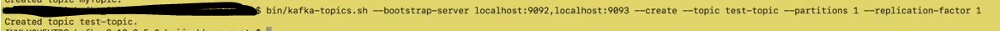

Describe it

Now increase the partition of this topic

    bin/kafka-topics.sh --bootstrap-server localhost:9092 --alter --topic test-topic --partition 2

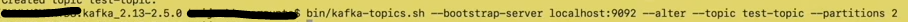

describe it again 

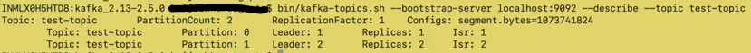

# Reassigning partitions

As per the above image, Partition 1 is in broker 1(Leader:1), if we dont want it to be in broker 1, 2 and wanted it to be in 2,3.

Use case:
- Move partitions across brokers
- Selectively move replicas of a partition to a specific set of brokers
- Increasing the replication factor

## Move partition across brokers

        Generate:
          bin/kafka-reassign-partitions.sh --zookeeper localhost:2181 --topics-to-move-json-file topicsToMove.json --broker-list "2,3" --generate

        Execute:
          bin/kafka-reassign-partitions.sh --zookeeper localhost:2181 --reassignment-json-file expand-cluster-reassignment.json --execute

        Verify:
           bin/kafka-reassign-partitions.sh --zookeeper localhost:2181 --reassignment-json-file expand-cluster-reassignment.json --verify

##### Create a json file -> topicsToMove.json:

[topicsToMove.json](topicsToMove.json)

Execute generate command:

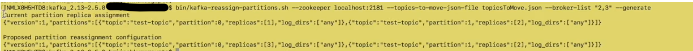

This command will give current and proposed assignment

This will give one more json content in the command window as proposed assignment. Copy it and create a new json file with the same.
Remove log_dirs from new json file. save it with the name suggestedChange.json

Execute:

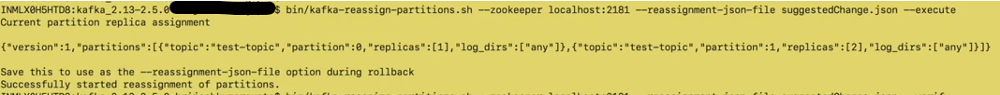

Verify:

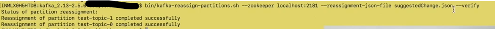

Describe:

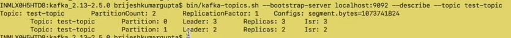

## Change replication(Increase replication)

We want Partition 0 replica to be created in broker 2,3
and Partition 1 replica to be created din broker 1,2

we will need to modify suggestedChange.json file created above to change replicas to 2,3 and 1,2 for respective partitions.

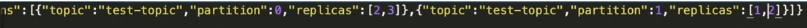

Execute and verify:

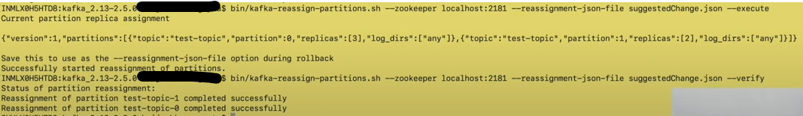

Describe:

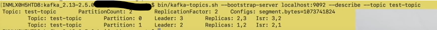

## Selectively move replica of a partition to a specific set of brokers

What we want now is the replica of partition 0 which are created in 2,3 to be created in 1,2

we will need to modify suggestedChange.json file created above to change replicas to 1,3 for partition 0 and remaining would be same.

Execute and verify:

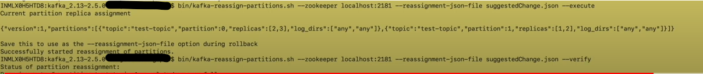

Describe:

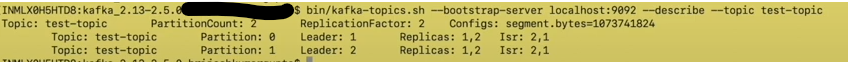

In this case leader will also change as replica we have removed

