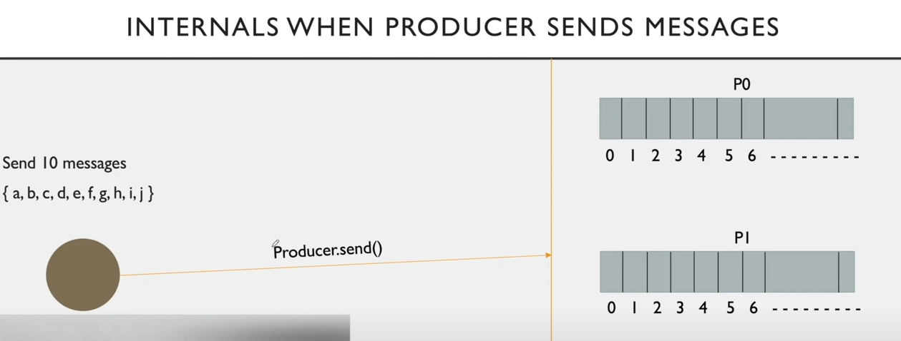
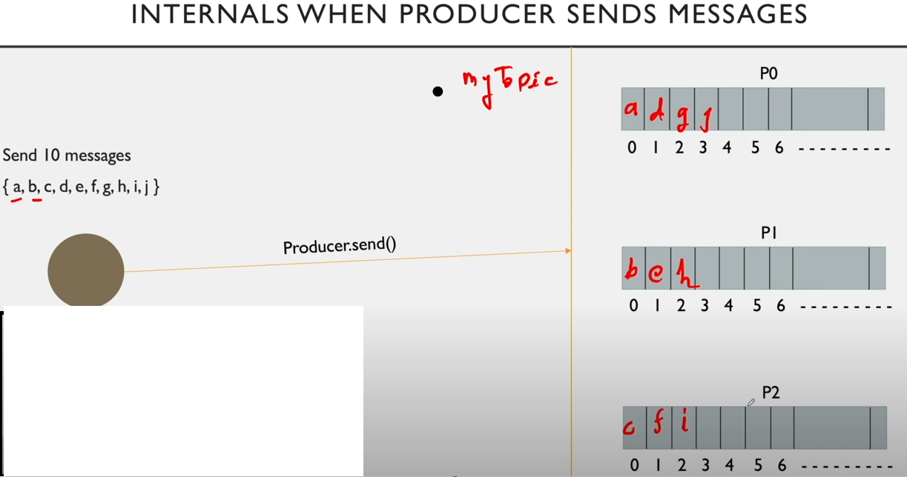
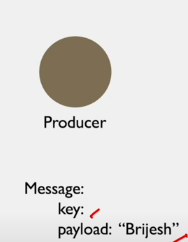
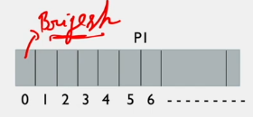
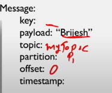

# Internals when producer sends message

Assume Producer is sending on topic level

- Also partition is 3
- Send message a,b,c,d,e,f,g,h,i,j
- It will use producer.send() api to send message to topic/partition

When producer start publishing message it by default publish in round-robin fashion to each partition

- Each partition are also having numbered block from 0,1,2,3, and so on
- These numbers are called offset
- whenever message is stored in partition, it will get sequence id(called offset)
- partition is a form of queue
- How 'd' is stored in partition -> it is under 'myTopic|Partition 0|Location 1'
- Significance of offset is only at partition level not at topic level.

### OFFSET

The records in the partition are each assigned a sequential id number called the offset that uniquely identifies each record with in the patition

Three variations of offset are:

1) Log-end offset: offset of the last message written to a log/partition. It will give total number of messages stored in the partition

        log-end offset of partition 0 is 3
        Total number of msg stored is 3+1 = 4

2) Current offset: Pointer to the last record that kafka has already sent to a consumer in the most recent poll

3) Committed offset: Marking an offset as consumed is called committed offset

When producer send message it send key and payload

    Key: it will be empty when we send msg at topic level. It will be mainly used when we send msg at partition level
            if key is null, then msg will be stored in round robin fashion in the partition
            if key is not null, then message will be send to the specific partition
    Payload:  actual message

if we send this message then it will store it as follows:

When broker save this message then it will store it in file system. It will store below metadata

- timestamp - it would be when broker save it in file system

