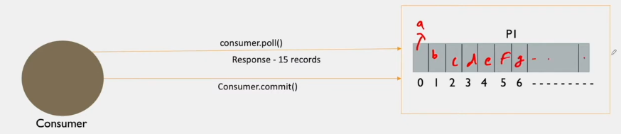

# Kafka Consumers

Assume consumer wants to consume message

Consumer can pull messages at topic or partition level. If it is consuming at topic level then it will get message from different partitions

When consumer request kafka cluster that it need msg from this topic then one configuration is set at consumer level to send the number of message per request.

if a topic contains 1000 msg and config is set to 15, then only 15 message will be pulled from cluster

consumer.pool() api is used to get messages from cluster.

    maxPollRecords=15 -> set at consumer level

consumer will start process each message then it will acknowledge kafka cluster that consumer has consumed this message

### Offset has 3 types as discussed earlier

1) Log-end offset
2) current offset: Kafka cluster contains current offset of the messages send to consumer group for the given topic

ex: suppose partition 1 contains 10 message and 5 messages are sent to consumer group then current offset will be 4 (index start from 0. but total 5 msg)

3) committed offset: Kafka cluster contains committed offset of the messages send to consumer group. 

ex: When the consumer group send the acknowledgement of msg processed by the consumer group, broker maintains committed offset.

    committed offset cant be greater than current offset

### Acknowledgement send from consumer group to Cluster is of 2 types:

These properties are set at consumer level.

1) Auto commit: rarely used as it may cause data loss. 

        When message received to consumer, acknowledgement will be send to the cluster automatically that the message is consumed and processed.
        This approach is not widely used as it may cuase data loss, because while processing msg if consumer failed then we cant resend it from kafka cluster as the acknowledgement is automatical send

2) Manual commit: 2 types

- send acknowledgement one by one after processing each message
- send acknowledgement to all poll message(based on maxPollRecords) after process entire batch of message based on poll size.
