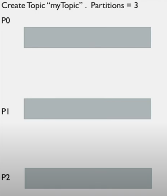
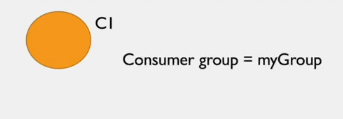
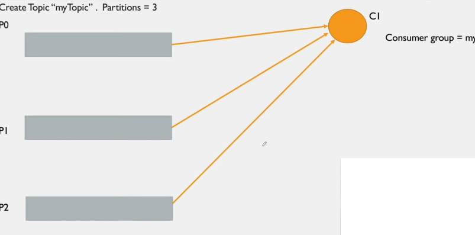
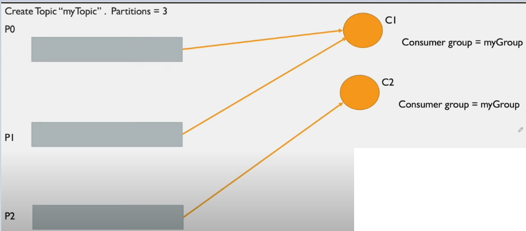
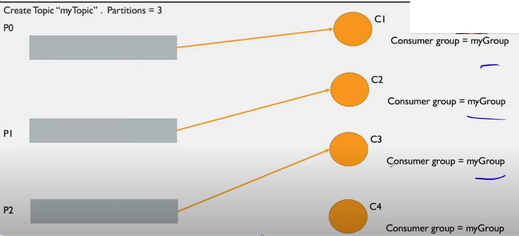

# Consumer Group Internals

- is a logical entity in kafka ecosystem which mainly provides Parallel processing /Scalable message consumption to consumer 
- each consumer must be associated with consumer group
- make sure there is no duplication within consumers who are part of the same consumer group
- one message can be only consumed by one consumer with in consumer group

### Use case 1:

Create a topic with 3 partition

Start consumer C1 in consumer group myGroup

As soon as consumer starts it will subscribe to all partition of the topic

### Use case 2:

Now lets create new consumer C2 with in same consumer group

As soon as c2 subscribe myTopic, partitions will be distributed between consumers

### Use case 3:

Now lets start c3 consumer within same consumer group amd c3 wants to subscribe myTopic

As we can see in the above picture, partition were again distributed

This is called consumer **group re-balancing**.

### Use case 4:

Now lets start c4 consumer within same consumer group amd c4 wants to subscribe myTopic

C4 will sit ideal and wont get any partition

    One partition will be assigned to only one consumer

## Consumer Group Re-balancing

Process of re-distributing partitions to the consumers within a consumer group . Happens in below cases:

1) A consumer joining the consumer group
2) A consumer leaving the consumer group
3) Id partitions are added to the topics which these consumers are interested in
4) If a partition goes in offline state

## Process involved in consumer group re-balancing

Involves 2 entity
- Group coordinator
- Group leader

## Group coordinator (Brokers are group coordinators)

- Brokers in kafka cluster are assigned as a group coordinator for a subset of consumer groups
- It basically maintains/manages a list of consumer groups
- initiates a re-balance process call
- communicates the new assignment of partitions to all the consumers

Note: Until the re-balance process is not finished, the consumers with in the CG will be blocked for any reads of messages 

- Assume Kafka cluster have 3 brokers
- It is joined by 10 CG
- Divide CG (3-3-4) and assign subset of CG to one broker. Who is responsible for managing these subset of CG.

Group coordinator is broker.

## Group leader

- First consumer to join Consumer Group is elected as group leader of CG
- has the list of active members and the selected assignment strategy
- executes the re-balance process
- sends the new assignment of partitions to the group coordinator

## What happens when a consumer join Consumer Group

1) when a consumer starts, it sends **FindCoordinator** request to obtain the group coordinator which is responsible for its group
2) After fining the group coordinator, the consumer initiates the re-balance protocol(partition reassignment to consumer in consumer group) by sending a **JoinGroup** request
    - GC initiates a re-balancing process call by informing group leader
    - Group leader executes re-balancing process according to the re-assignment strategy 
    - Group leader sends the new assignment of partitions to the group coordinator
    

3) Next, all members of that CG send a **SyncGroup** request to the group coordinator
    - GC communicates the new assignment of partitions to all the consumers

4) Each consumer periodically sends a **Heartbeat** request to the GC to keep its session alive and able to process records

