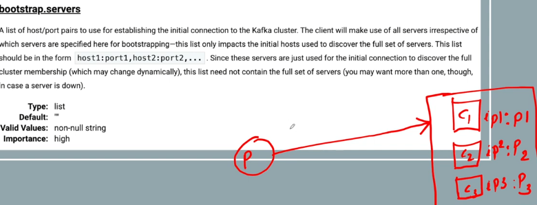
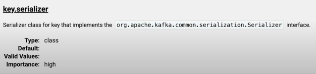
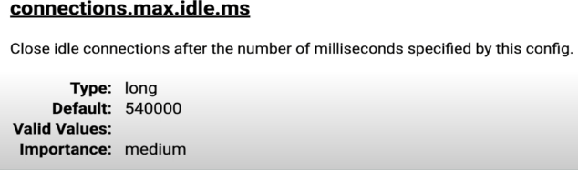
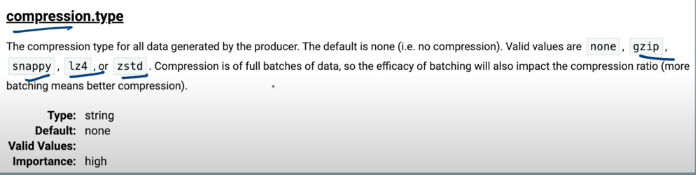
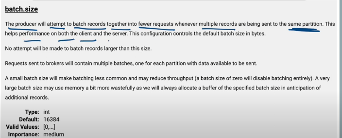
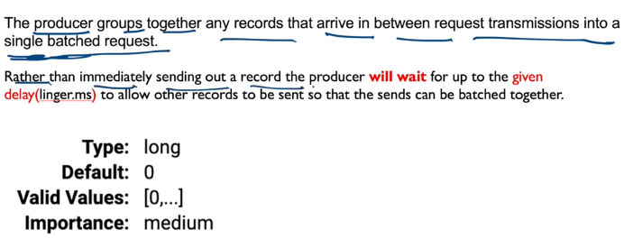
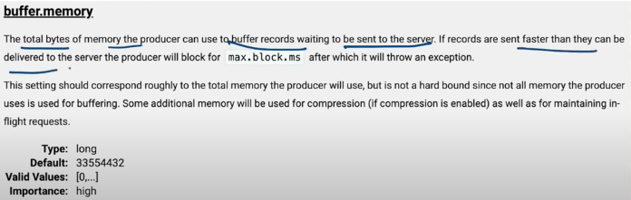

# Producer Config

If you are running console producer then check producer.config file

### 1) bootstrap.servers:

- is used to connect to kafka cluster
- whenever we start producer, it would required bootstrap.servers address in order to connect to kafka cluster
- if kafka cluster have 12 broker, it is not necessary to provide all server in the command, we just need to provide few of them
- servers provided in the command will be only used for making initial connection
- all the other servers will also be discovered using these initial servers
- and also be used in connection

### 2) client.id

- used to trace the request
- mainly used for debugging

### 3) key.serializer

- serialization is the process of converting an object into a stream of bytes so that we can transmit over the network
- used to persist the object
- to transmit an object across a network
- default value is byteArraySerializer

### 4) value.serializer

- - serialization is the process of converting an object into a stream of bytes so that we can transmit over the network
- used to persist the object
- to transmit an object across a network
- default value is byteArraySerializer

### 5) connections.max.idle.ms

- close idle producer connections after the number of ms specified by this config
- default value is 9 mins

### 6) acks

- stands for acknowledgement
- when producer sends records, it waits for the ack from kafka cluster
- 3 setting are possible
- acks=0 -> then producer will not wait for any acks from the server at all. No guarantee can be made that the server has received the record.
- acks=1 -> (DEFAULT) this will mean that leader will write the record to its local log but will respond without awaiting full ack from the followers.
if leader fails immediately after ack the record but before followers have replicated it then the record will be lost

- acks=-1 -> Leader will wait for full set of in-sync replicas to ack the record. This guarantees that th erecord will not be lost.
This is equal to acks=all setting.

Recommended is acks=-1 but there will be latency as leader will wait until followers have replicated it. 

### 7) compression.type
- used to compress messages
- default is none i.e no compression
- it supports 4 types of compression. gzip,snappy,lz4,zstd
- conpression happens for entire batch not for individual record

### 8) batch.size
- rather than producing individual record, kafka provides flexibility of sending record in batches
- batches happens on the basis of size not message count
- batches will be created only for the same partition
- for each partition batches will be different
- default batch size is 16 kb 

if individual record is 20kb then it will not batch other record, it will send individual record with 20 kb.(wont split the record)

- batch size 0 will disable batching
- large batch size will create buffer memory in ram.

### 9) linger.ms

### 10) buffer.memory

### 11) max.request.size

How to pass properties

