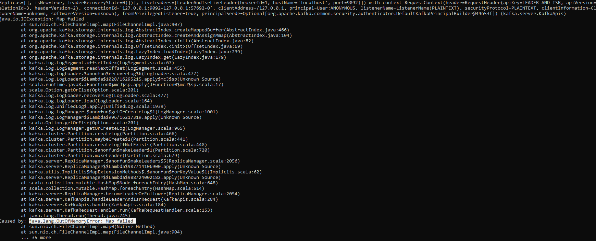

1) java.lang.OutOfMemoryError: Map failed OR java.io.IOException: Map failed

Stack Trace:

Solution:

    It turned out related to Java heap size. I made a change in the Kafka startup script file: ${kafka_home}/bin/windows/kafka-server-start.bat
    
    IF NOT ERRORLEVEL 1 (
    rem 32-bit OS
    set KAFKA_HEAP_OPTS=-Xmx512M -Xms512M
    ) ELSE (
    rem 64-bit OS
    rem set KAFKA_HEAP_OPTS=-Xmx1G -Xms1G => Commented this
    rem added this below line
    set KAFKA_HEAP_OPTS=-Xmx512M -Xms512M
    )
    I solved it by **upgrading their Java from 32bit to 64bit application**. 
    

2) Zookeeper is up and running. Attempted to start Kafka server and it failed.

Command
kafka-server-start.bat C:\Installs\kafka_2.12-2.5.0\config\server.properties

Error
kafka.zookeeper.ZooKeeperClientTimeoutException:
Timed out waiting for connection while in state: CONNECTING

Stack Trace
........
........
2020-07-19 01:20:32,081 ERROR Fatal error during KafkaServer startup.
Prepare to shutdown (kafka.server.KafkaServer) [main]
kafka.zookeeper.ZooKeeperClientTimeoutException:
Timed out waiting for connection while in state: CONNECTING
at kafka.zookeeper.ZooKeeperClient.$anonfun$waitUntilConnected$3(ZooKeeperClient.scala:268)
at scala.runtime.java8.JFunction0$mcV$sp.apply(JFunction0$mcV$sp.java:12)
at kafka.utils.CoreUtils$.inLock(CoreUtils.scala:251)
at kafka.zookeeper.ZooKeeperClient.waitUntilConnected(ZooKeeperClient.scala:264)
at kafka.zookeeper.ZooKeeperClient.(ZooKeeperClient.scala:97)
at kafka.zk.KafkaZkClient$.apply(KafkaZkClient.scala:1694)
at kafka.server.KafkaServer.createZkClient$1(KafkaServer.scala:348)
at kafka.server.KafkaServer.initZkClient(KafkaServer.scala:372)
at kafka.server.KafkaServer.startup(KafkaServer.scala:202)
at kafka.server.KafkaServerStartable.startup(KafkaServerStartable.scala:38)
at kafka.Kafka$.main(Kafka.scala:75)
at kafka.Kafka.main(Kafka.scala)
2020-07-19 01:20:32,088 INFO shutting down (kafka.server.KafkaServer) [main]
2020-07-19 01:20:32,105 INFO shut down completed (kafka.server.KafkaServer) [main]
2020-07-19 01:20:32,106 ERROR Exiting Kafka. (kafka.server.KafkaServerStartable) [main]
2020-07-19 01:20:32,121 INFO shutting down (kafka.server.KafkaServer) [kafka-shutdown-hook]

Solution:

    Investigation lead to increasing the timeout settings for Kafka-Zookeeper. Because of environment settings (RAM, CPU, etc), it turns out this plays some role.
    I updated the ${kafka_home}/config/server.properties file:
    
    # Timeout in ms for connecting to zookeeper (default it was 18000)
    zookeeper.connection.timeout.ms=36000
    I read many other reasons for this error (did not look applicable to my case) like:
    
    zookeeper service not running
    restarting system
    zookeeper is hosted on zookeeper:2181 or other server name instead of localhost:2181

3) I tried to delete Kafka topic because I was having problems while pushing message from Producer.

Command
kafka-topics.bat --list --bootstrap-server localhost:9092 --delete --topic my_topic_name

Error
Topic test is already marked for deletion

Stack Trace
Topic test is marked for deletion.
Note: This will have no impact if delete.topic.enable is not set to true.

Solution:

    I enabled topic deletion configuration. It needs to be set as delete.topic.enable = true in file ${kafka_home}/config/server.properties. Restarted the server post updating the config.
    
    # Delete topic enabled
    delete.topic.enable=true

4) Zookeeper & Kafka is up and running. I get an error when I try to create a Topic.

Command
kafka-topics.bat --create --bootstrap-server localhost:9092
--replication-factor 1 --partitions 1 --topic testkafka
Error
org.apache.kafka.common.errors.TimeoutException: Timed out waiting for a node assignment

Stack Trace
Error while executing topic command : org.apache.kafka.common.errors.TimeoutException:
Timed out waiting for a node assignment.
[2020-07-19 01:41:35,094] ERROR java.util.concurrent.ExecutionException:
org.apache.kafka.common.errors.TimeoutException: Timed out waiting for a node assignment.
at org.apache.kafka.common.internals.KafkaFutureImpl.wrapAndThrow(KafkaFutureImpl.java:45)
at org.apache.kafka.common.internals.KafkaFutureImpl.access$000(KafkaFutureImpl.java:32)
at org.apache.kafka.common.internals.KafkaFutureImpl$SingleWaiter.await
(KafkaFutureImpl.java:89)
at org.apache.kafka.common.internals.KafkaFutureImpl.get(KafkaFutureImpl.java:260)
at kafka.admin.TopicCommand$AdminClientTopicService.createTopic(TopicCommand.scala:163)
at kafka.admin.TopicCommand$TopicService.createTopic(TopicCommand.scala:134)
at kafka.admin.TopicCommand$TopicService.createTopic$(TopicCommand.scala:129)
at kafka.admin.TopicCommand$AdminClientTopicService.createTopic(TopicCommand.scala:157)
at kafka.admin.TopicCommand$.main(TopicCommand.scala:60)
at kafka.admin.TopicCommand.main(TopicCommand.scala)
Caused by: org.apache.kafka.common.errors.TimeoutException:
Timed out waiting for a node assignment.
(kafka.admin.TopicCommand$)

How I Solved?
    
    For once, it worked for me as is but when I tried again later, I kept getting this error. 
    While looking on the web, suggestions were to enable listener and set it up like: listeners=PLAINTEXT://localhost:9093 in the server config file.
    
    Before attempting this, I rebooted my system as it was little sluggish too. Turns out, mostly it was memory issue. 
    I was in a Windows VM and probably it was craving for memory space. Without a change, things worked fine as is for me.

