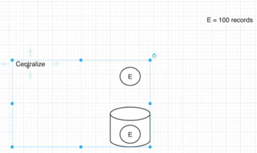
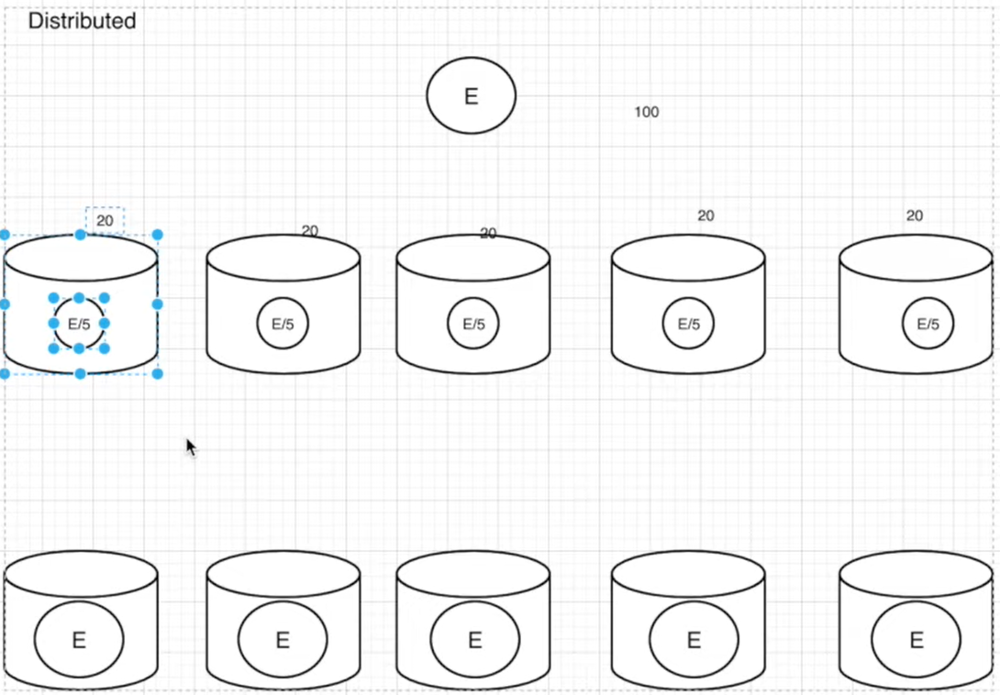
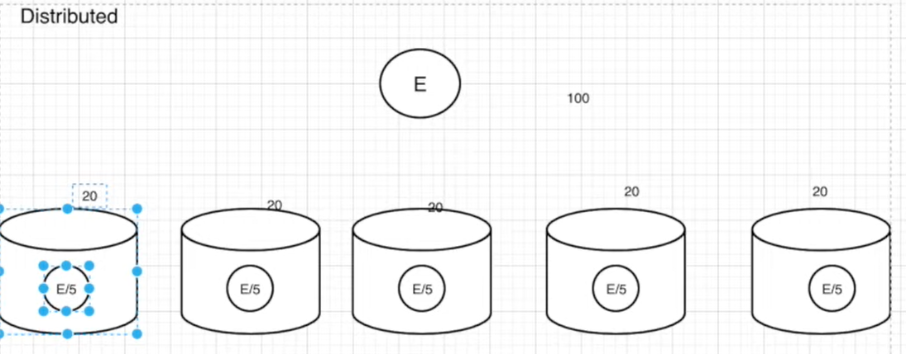
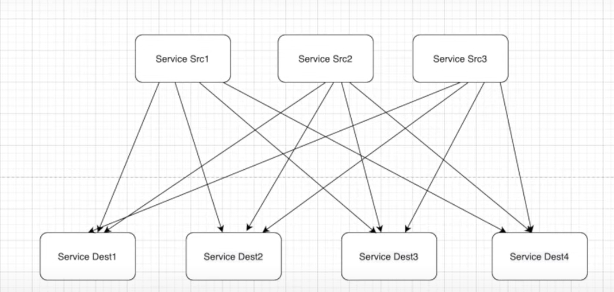
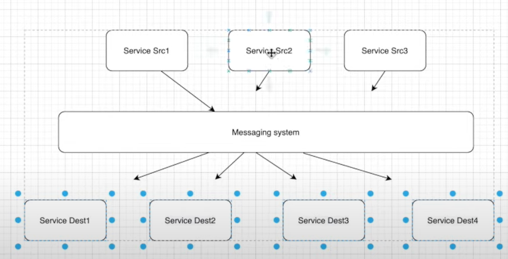
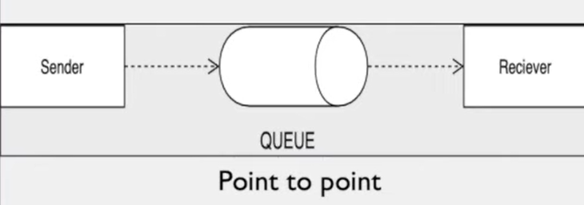
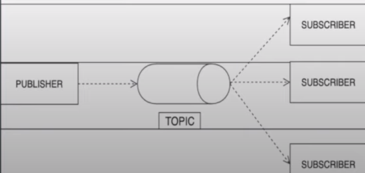

# KAFKA-IN-DEPTH

**What is kafka:**

- High throughput, distributed messaging system
- Distributed Message streaming platform that uses publish and subscribe mechanism to stream the records
- Developed by LinkedIn and later donated to apache foundation
- Kafka is open source

**Centralize:**

Store all data in only one location. If one system crash all data will be lost

Entity will be stored only in single location. Here one entity contains 100 records

**Distributed:**

Distribute entity in multiple location. 

We can do distribution in two ways:

1) Break the entity and store in multiple location
 
Ex - lets assume we have break the entity equally and store it in 5 different location. If one location crashes then we will just lose 20 records of entity and not entire data

Still better than centralized approach. To overcome this problem we have another approach

2) Or copy entire entity in multiple location. We called this approach as replication.
100 records will be stored in multiple location

**Demerit** - more space is getting used. Data redundancy is increased

**Merit**: if one system crashes even though we can recover the entire entity from other system

Kafka follow both type of distribution. It is up to us which configuration we set.

**Message streaming platform:**

In this example we have 3 source system and 4 destination system.
All source system are sending data to all destination system
We have total 12 connection in total. This is just an example. In case of enterprise system we have thousands of system communication to each other

Each connection comes with own difficulties like data format, connection type(http, tcp, jdbc), schema.
For an enterprise managing these connection is bottleneck. To solve this problem (number of connection, tightly coupled), messaging system comes to rescue.

now the source service will send the data to messaging system only and destination service will pick the data from messaging system
Total connection 7.

This similar work can be done by DB, where in, we can store the data in DB table from source system and destination can get it from the relevant tables.
Messaging System comes with an advantage
When data is received from source, interested destination system will get the notification about new data.

Notification are of 2 types. Pull and Push notification (will cover later)

**Two types of Messaging system:**
A messaging system is responsible for transferring data from one application to another so the application can focus on data without getting bogged down on data transmission and sharing.

**Point to Point :**
1) One Sender and One receiver
2) Messages are persisted in Queue
3) Particular message can be consumed by max one consumer
4) When sender sends teh message to queue, receiver get the notification about the message. But there is no time dependency for the receiver to consume the message from the queue
5) As soon as message is consumed by receiver, it gets deleted from queue
6) When receiver receives the message, a notification is sent back to Sender

**Publish-Subscribe:**
1) Message are persisted in topic
2) Particular message can be consumed by any number of consumer
3) Subscriber has a time limit(configurable - default is 7 days) to consumer the message from topic
4) When subscriber receive teh message it doesn't send the notification back to sender

