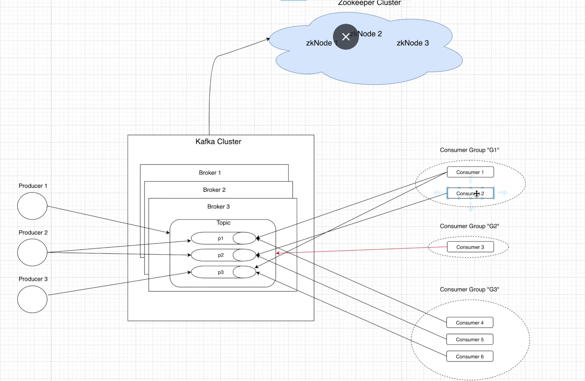
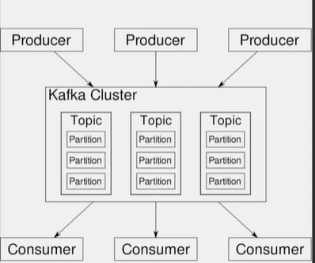
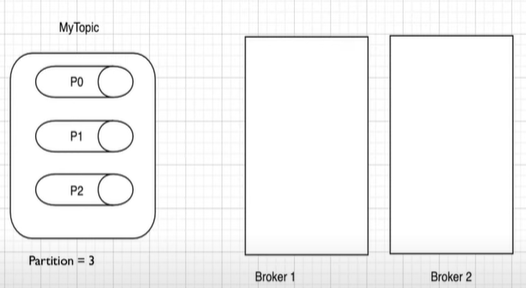
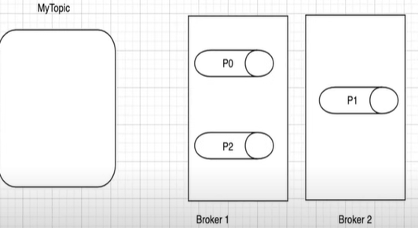
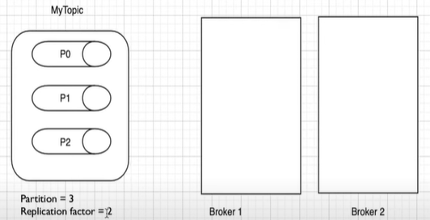
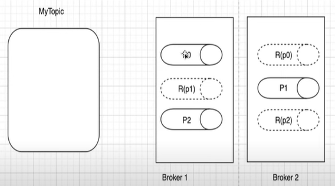

# KAFKA Architecture

- We have Kafka Cluster which contains multiple brokers and each brokers contains some topics and each topic contains multiple partitions
- Zookeeper manages kafka cluster 
- Zookeeper cluster contains multiple zookeeper nodes
- Producers produces messages to topic level and partitions level
- Consumers consumes messages from topic level and partitions level
- Each consumer is associated with some consumer group

**Topics**
- Stream of messages belonging to a particular category
- Similar to a table in DB where in we store only similar category of data
- Unique Identifier of a topic is its name
- we can create as many topics as we want.
- We cant create 2 topics with same name
- Two Properties are partition and replication

**Partitions**
- Topics are split into partitions
- all the messages within partition are ordered and immutable
- each message within a partition has a unique id associated which is known as OFFSET

We split topics in to partition and distribute to multiple brokers

Distribution happens in round-robin fashion to brokers

**Replica/Replication**
- are backups of partition
- used to prevent data loss
- Producer can never produce data on replica
- Similarly consumer can not read data from replica
- Replication factor = 2 means each partition will have exactly two replica

After distribution partition are replicated to multiple brokers to prevent data loss

**Producers:**
- are application which produces/write data to topics/partitions within a cluster

Writing data at topic level:
- If a topic has 3 partition and producer is writing data at topic level then message will be public in round-robin fashion to all partition
message 1 to partition 1, msg 2 to partition 2 and so on
Writing data at partition level:
- producer can write data at partition level using some configuration(cover later)

**Consumers:**
- are application who consumes data from topics/partitions
- are always associated with one consumer group
- Consumer group is a group of related consumers that perform a task

**Brokers:**
- are the software processes who manage the topics ans the messages present in the topics
- also managers the consumers by holding info about messages consumer by consumer from topics and partitions
- also known as kafka servers
- also manages the consumer-offset and are responsible for the delivery of messages  to the right consumer
- a set of brokers who are communicating with each other to perform the management and maintainence task are collectively known as Kafka CLuster
- we can add more brokers in already running kafka cluster without any downtime
- There will be one controller among multiple brokers

**Zookeepers:**
- manages kafka cluster
- communicates each broker to take the status
- each broker send heartbeat to zookeeper to let zk know that broker is alive and working
- keeps all metadata info related to kafka cluster in the form of key-value pair
- Metadata includes - Config info and health status of each broker
- It is also used for controller election within kafka cluster. Meaning ZK helps in electing the controller among broker
- a set of ZK nodes working together to manage other distributed system is known as ZK cluster or ZK Ensemble

Features:

- Scalable - Horizontal scaling is done by adding new brokers
- Fault tolerant - can handle failures because of its distributed nature
- Durable
- Performance - high throughput
- No data loss
- Zero down time
- Reliablity
