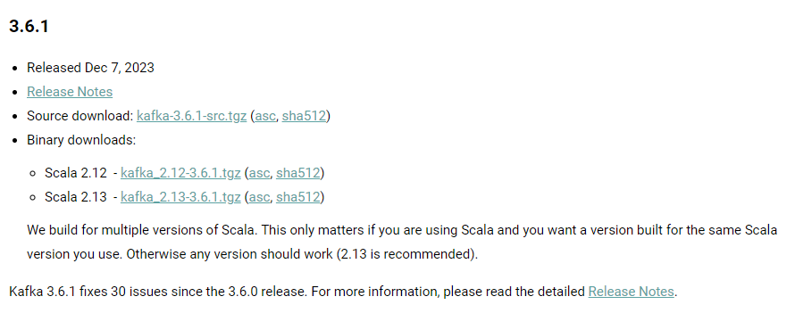
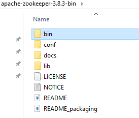

### Kafka Installation

* Require java 8 or higher version
* Minimum RAM 512 mb
* Kafka is written in JAVA and scala
* We need JAVA and scala binary
* Current version as of Dec, 2023 is 3.6.1

**Download Apache Kafka from official page**

**Step 1:** Download Scala 2.13 binary and check release notes for stable zookeeper version

**Step 2:** Download compatible zookeeper version 3.8.3 (Download bin.tar.gz file)

We first need to setup zookeeper then kafka cluster

**Extract scala and kafka binaries**

    from command line use command tar -xf filename

After extracting we need to start zookeeper server.

    goto bin/zkServer.sh or bin/zkServer.cmd -> used for starting zookeeper server

It searches for config file in location conf/zoo.cfg

We need to create that file from sample

    add property 4lw.commands.whitelist=* -> 4 letter words

Property meaning - 

* clientPort=2181 (if any clients wants to connect zookeeper then it will use this port)
* dataDir=tmp/zookeeper (whatever data zookeeper keep related to cluster resides in this. tmp is volatile dir so data removed after restart)

Now start zookeeper using bin/zkServer.sh start-foreground

this command takes other param like start/stop/start-foreground/restart/status/print-cmd

### Installation instructions for Kafka/Zookeeper on Windows

* Install Java JDK
* Set env variable 'JAVA_HOME' to 'c:\Program Files\Java\jdk1.8.0_144'
* Set env variable 'ZOOKEEPER_HOME' to 'C:\dev\Kafka\zookeeper-3.4.10', and append 'C:\dev\Kafka\zookeeper-3.4.10' to "Path" sys variable
* Rename "zoo_sample.cfg" to "zoo.cfg" in C:\Tools\zookeeper-3.4.10\conf, and change its value for "dataDir" from "/tmp/zookeeper" to "c:\zookeeper-3.4.10\data" (or whatever)
* Run "C:\dev\Kafka\zookeeper-3.4.10\bin\zkServer.cmd"
* Open 'C:\dev\Kafka\kafka_2.11-0.11.0.0\config\server.properties' and set its value for "log.dirs" to "C:/dev/Kafka/kafka_2.11-0.11.0.0/kafka-logs"
* Run "C:\dev\Kafka\kafka_2.11-0.11.0.0\bin\windows\kafka-server-start.bat C:\dev\Kafka\kafka_2.11-0.11.0.0\config\server.properties"
* Use Kafka Tool (www.kafkatool.com/index.html) to connect to localhost:2181

