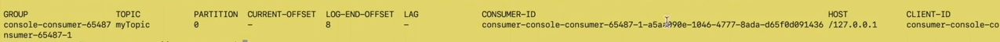
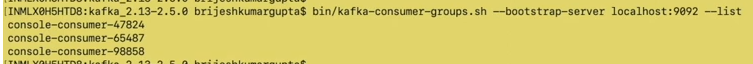

# Topic creation

    bin/kafka-topic.sh --bootstrap-server localhost:9092 --create --topic myTopic --partitions 1 --replication-factor 1

    bootstrap-server -> Kafka server uri to which it will connect. localhost:9092

### Validate/List Topic:

    bin/kafka-topic.sh --bootstrap-server localhost:9092 --list

### Describe Topic:

    bin/kafka-topic.sh --bootstrap-server localhost:9092 --describe --topic myTopic

    first line will tell topic properties.
        partition count is 1
        replication factor is 1
    second line will tell partition level properties
        Partition Id will start from 0. Id only one partition then Id will be 0, 2 partition -> Ids - 0 and 1
        as we have just created 1 partition we have single line
        Leader: When we create partition for any topic and fro the given list of broker in cluster, one will be elected as leader of teh partition and all read/write will happen from the leader
        Replicas: this partition will be peplicated on which broker. Replicas 1 -> is broker id 1
        InSyncReplica: How many replicas of this partition is in sync

# Create console Producer

    bin/kafka-console-producer.sh --bootstrap-server localhost:9092  --topic myTopic 
    after giving above command
    type message -> this is sample message

# Create console Consumer

    bin/kafka-console-consumer.sh --bootstrap-server localhost:9092  --topic myTopic --from-beginning
    
    from-beginning -> start consuming all messages from starting
    if we dont give from-beginning then it will only start consuming new messages

Every consumer is associated with consumer group. But we haven't specify consumer group in the above command

So what kafka will do here it will create consumer group automatically. To check consumer group:

    bin/kafka-consumer-groups.sh --bootstrap-server localhost:9092  --list

# Describe consumer group

    bin/kafka-consumer-groups.sh --bootstrap-server localhost:9092  --describe --group console-consumer-12345
    

    LOG_END_OFFSET - total number of messages in this partition

# Kafka Consumer Offset Topic

    This topic is Created by Kafka to store consumer offset and from which topic
    bin/kafka-topic.sh --bootstrap-server localhost:9092 --list
    This will give below result which contains __consumer_offsets topic

# Create multiple producers and consumers on myTopic

    use same command to create multiple producers as above
    use same command to create multiple consumers as above

    if we produce any message from any producer then it will be consumed by all running consumer for same topic

As we have created multiple consumer without providing consumer group, kafka will create unique consumer group from all consumer

# Create consumers on myTopic with custom consumer group

    bin/kafka-console-consumer.sh --bootstrap-server localhost:9092  --topic myTopic --from-beginning --group myConsumerGroup
    bin/kafka-topic.sh --bootstrap-server localhost:9092 --list

