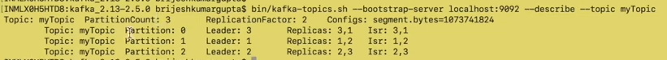

# Controller Node in Kafka

- Any Kafka cluster have only one controller node
- Which is responsible for managing the state of partitions and replicas and for performing admin task like reassigning partitions

To understand controller node functionality

- create kafka cluster with 3 nodes
- create topic with 3 partitions and 2 replication factor

After creating topic describe it:

- For Partition 0 
    
    Have 2 replicas in broker 1 and broker 2
    Leader is 1 which implies all read and write will happen from broker 1. Main working replica will be broker 1. Broker 2 will only come in to picture in case broker 1 is down
    **ISR is 1,2 - ISR will always be the subset of replicas. Possible combination of ISR could be {1},{2},{1,2} depending on both brokers are up or not
                 Both the brokers will always be in sync. When producer send a message to broker 1(broker 1 is leader of partition 0) then broker 2 will send a fetch request to broker 1 in order to be in sync with broker 1**

- For Partition 1

    Have 2 replicas in broker 2 and broker 3
    Leader is 2 which implies all read and write will happen from broker 2. Main working replica will be broker 2. Broker 3 will only come in to picture in case broker 2 is down

### State of Partition:

1) NonExistentPartition: indicated that the partition was either never created or was created and then deleted
2) NewPartition: After creation, the partition is in the NewPartition state. In this partition should have replicas assigned to it, but no leader/ISR yet/. cant perform read/write in this state
3) OnlinePartition: Once leader is elected it is in this state. We can read/write.
4) OfflinePartition: After successful leader election, if the leader of partition dies, then it moves to this state

These state is managed by controller node.

### State of Replica:

1) NewReplica: Replica created during topic creation or partition reassignment. 
2) OnlineReplica: It is replicating from Leader. In this state it can either become leader or become follower
3) OfflineReplica: if replica dies. This happens when the broker hosting the replica is down 
4) NonExistentReplica: if replica is deleted.

    
    Controller node manage state of partition and replicas
    Also manages state transition of partition and replicas

### Reassigning partitions

